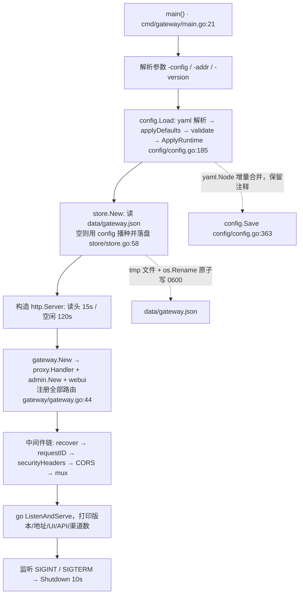
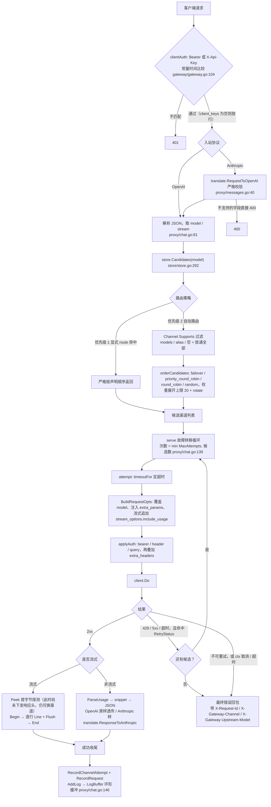
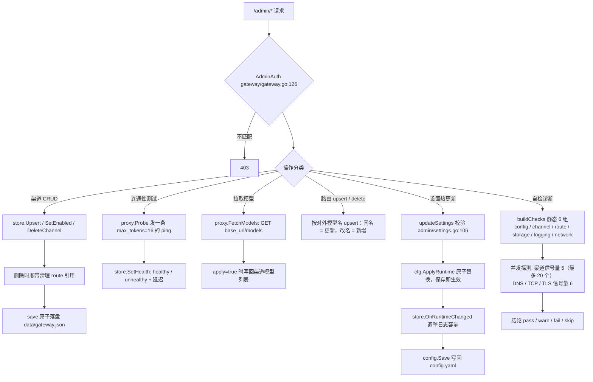

# apitoken · 多平台大模型 API 网关

一个用 Go 编写的 **OpenAI 兼容** 大模型网关：把 **DeepSeek**、**商汤日日新 SenseNova**、**腾讯云 WorkBuddy（代码助手）** 以及任意 OpenAI 兼容服务的 API Key 集中管理，对外只暴露一个 `base_url` + 一个网关密钥。

- 统一协议：`POST /v1/chat/completions`（含 SSE 流式）、`GET /v1/models`
- 多渠道：同一模型可绑定多个平台/账号，按优先级 + 权重负载均衡
- 自动故障转移：上游 429/5xx/超时自动切换下一个渠道
- 零依赖运行：单二进制 + 一个 YAML 配置，内置 Web 管理页（无前端构建）
- 可观测：token 用量、成功率、平均延迟、最近 500 条访问日志
- 鉴权：客户端 Key（`Authorization: Bearer`）与管理令牌分离

---

## 1. 快速开始

```bash
# Windows
go build -o apitoken.exe ./cmd/gateway
.\apitoken.exe -config config.yaml

# Linux / macOS
go build -o apitoken ./cmd/gateway
./apitoken -config config.yaml
```

启动后：

| 地址 | 说明 |
| --- | --- |
| http://127.0.0.1:8080/ | Web 控制台：渠道、路由、用量看板（填入管理令牌 `adm-0001`）；渠道列表可按名称/ID/模型名筛选、模型多时默认折叠 |
| http://127.0.0.1:8080/logs | 调用日志：筛选、分页、故障转移链路、导出 |
| http://127.0.0.1:8080/chat | 对话：像第三方客户端一样与网关对话，验证是否可用（模型下拉支持关键词搜索） |
| http://127.0.0.1:8080/diagnostics | 测试：网关自检、渠道体检、出网诊断 |
| http://127.0.0.1:8080/settings | 设置：修改网关密钥、路由、日志、超时（保存即生效） |
| http://127.0.0.1:8080/v1 | OpenAI 兼容接口（网关密钥 `sk-gateway-0001`） |
| http://127.0.0.1:8080/v1/messages | Anthropic Messages 兼容接口（同一把网关密钥，见 9.6） |
| http://127.0.0.1:8080/admin/… | 管理 API |
| http://127.0.0.1:8080/healthz | 健康检查 |

所有页面右上角有主题按钮（跟随系统 / 深色 / 浅色），选择会记在浏览器本地；
在「设置 → 界面外观」可指定默认主题并写回配置（`ui.theme`）。

命令行参数：`-config`（配置路径）、`-addr`（覆盖监听地址）、`-version`。

> 渠道/路由的改动会持久化到 `data/gateway.json`，重启后依然生效；配置文件里新增的渠道会自动补进来。

---

## 2. 接入平台（填 Base URL 即可）

网关只做一件事：把请求按 OpenAI 兼容协议转发到上游的 `{base_url}/chat/completions`，并注入 `Authorization: Bearer {api_key}`。
所以接任何平台都只需要 **Base URL + API Key + 模型名** 三样，不需要选“平台类型”。

| 平台 | Base URL |
| --- | --- |
| DeepSeek | `https://api.deepseek.com/v1` |
| 商汤日日新（Token Plan） | `https://token.sensenova.cn/v1` |
| 商汤（大装置 compatible-mode） | `https://api.sensenova.cn/compatible-mode/v2` |
| 腾讯云 WorkBuddy / 代码助手（标准版） | `https://api.copilot.tencent.com/api/v1` |
| 腾讯云 WorkBuddy（专享版） | `https://{enterpriseId}.copilot.qq.com/api/v1` |
| OpenCode Zen | `https://opencode.ai/zen/v1` |
| 阶跃星辰 StepFun（按量） | `https://api.stepfun.com/v1` |
| 阶跃星辰 StepFun（Coding Plan） | `https://api.stepfun.com/step_plan/v1` |
| OpenAI | `https://api.openai.com/v1` |

### 2.1 DeepSeek

| 项 | 值 |
| --- | --- |
| base_url | `https://api.deepseek.com/v1` |
| 鉴权 | `Authorization: Bearer <api_key>` |
| 模型 | `deepseek-chat`、`deepseek-reasoner`（推理模型，思维链在 `reasoning_content`） |
| 申请 Key | https://platform.deepseek.com/api_keys |

### 2.2 商汤 日日新 SenseNova

| 项 | 值 |
| --- | --- |
| base_url（Token Plan / OpenAI 兼容） | `https://token.sensenova.cn/v1` |
| base_url（大装置 compatible-mode） | `https://api.sensenova.cn/compatible-mode/v2` |
| 鉴权 | `Authorization: Bearer <api_key 或 api_token>` |
| 模型 | 以控制台为准，如 `SenseNova-6.8-Flash-Lite`；可在界面点「拉取模型」自动获取 |

### 2.3 腾讯云 WorkBuddy（代码助手）

| 项 | 值 |
| --- | --- |
| base_url（标准版） | `https://api.copilot.tencent.com/api/v1` |
| base_url（专享版） | `https://{enterpriseId}.copilot.qq.com/api/v1` |
| 鉴权 | `Authorization: Bearer <API Key>` |
| 模型 | 由账号套餐决定，建议在界面点「拉取模型」；拉取失败时手动填写或留空（留空=放通全部模型名） |

文档：https://www.workbuddy.cn/apiDocs/index.html

### 2.4 OpenCode Zen（订阅 / 按量）

| 项 | 值 |
| --- | --- |
| base_url | `https://opencode.ai/zen/v1` |
| 鉴权 | `Authorization: Bearer <Zen API Key>`（环境变量 `OPENCODE_API_KEY`） |
| 可走 `/chat/completions` 的模型 | `deepseek-v4-pro`、`deepseek-v4.1-flash`、`kimi-k2.7-code`、`glm-5.3`、`minimax-m3` 等 |
| 文档 | https://open-code.ai/docs/zen |

⚠️ Zen 按模型族分端点：Claude 系走 `/messages`、GPT 系走 `/responses`、Gemini 走 `/models/{id}`。
本网关**只做协议透传，不会转换请求体**——把渠道的「Chat 路径」改成 `/messages` 或 `/responses` 只会让上游收到
OpenAI 格式的 body 从而返回 400。Claude 系模型请走第 9.6 节的 Anthropic 兼容入口；
GPT 系（`/responses`）与 Gemini 暂未支持转换。

### 2.5 阶跃星辰 StepFun

| 项 | 值 |
| --- | --- |
| base_url（按量） | `https://api.stepfun.com/v1` |
| base_url（Coding Plan 订阅） | `https://api.stepfun.com/step_plan/v1` |
| 鉴权 | `Authorization: Bearer <api_key>` |
| 模型 | `step-3.5-flash`、`step-2-16k`、`step-1x-32k` 等，以控制台为准 |
| 文档 | https://platform.stepfun.com/docs |

---

## 3. 添加渠道（Web 界面）

1. 打开 http://127.0.0.1:8080/ ，右上角填入 `security.admin_token`（默认 `adm-0001`）并保存。
2. 「添加渠道」→ 填 **Base URL**（输入框有常用地址提示，填到 `/v1` 这一层，不要带 `/chat/completions`）与 **API Key**。
3. 「支持的模型」填模型名（逗号分隔，留空表示放通全部），保存。
4. 点「**测试连通性**」验证（会真实发一条 `ping` 请求，结果直接显示在弹窗内）；点「**拉取模型**」从上游 `/models` 拉取模型列表，勾选后一键写入「支持的模型」。这两个操作在保存之前就能用，草稿不会落库。
5. 需要多账号时，重复添加多个渠道，用 **优先级**（越小越优先）与 **权重** 控制分流。

命令行等价操作：

```bash
curl -X POST http://127.0.0.1:8080/admin/channels \
  -H "X-Admin-Token: adm-0001" -H "Content-Type: application/json" \
  -d '{"id":"deepseek-1","name":"DeepSeek 官方","base_url":"https://api.deepseek.com/v1","api_key":"sk-xxx","models":["deepseek-chat"],"priority":10,"enabled":true}'
```

---

## 4. 调用方式

### curl

```bash
curl http://127.0.0.1:8080/v1/chat/completions \
  -H "Authorization: Bearer sk-gateway-0001" \
  -H "Content-Type: application/json" \
  -d '{"model":"deepseek-chat","messages":[{"role":"user","content":"你好"}]}'
```

### OpenAI SDK（Python）

```python
from openai import OpenAI

client = OpenAI(api_key="sk-gateway-0001", base_url="http://127.0.0.1:8080/v1")

print(client.chat.completions.create(
    model="deepseek-chat",                       # 换成 SenseNova / WorkBuddy 上的模型名即可
    messages=[{"role": "user", "content": "你好"}],
).choices[0].message.content)

stream = client.chat.completions.create(
    model="deepseek-chat",
    messages=[{"role": "user", "content": "写首诗"}],
    stream=True,
)
for chunk in stream:
    print(chunk.choices[0].delta.content or "", end="", flush=True)
```

### OpenAI SDK（Go）

```go
client := openai.NewClientWithOptions("http://127.0.0.1:8080/v1", openai.WithToken("sk-gateway-0001"))
```

其它客户端（Cline、Chatbox、NextChat、OpenCode 等）只需把 `base_url` 指向 `http://127.0.0.1:8080/v1`，API Key 填网关密钥。

---

## 5. 路由与故障转移

路由弹窗里全部是下拉/点选，无需手写 JSON（弹窗标题会标明当前是「添加路由」还是「更新路由：xxx」）：
- **对外模型名**：下拉来自各渠道已声明的模型（含已有路由名），可搜关键词；**列表里没有的名字直接敲进去回车即可**（客户端对外用的名字本就可以自定义）
- **渠道顺序**：下拉添加 + ↑↓ 调整顺序，顺序即故障转移顺序
- **模型映射**：先在「① 先选择渠道」下拉里选渠道，右侧「② 再选择模型」会自动列出该渠道可用的模型名（分组：本渠道模型 / 网关其他已知模型），
  选中后点「加入路由」；不需要映射就选「（跟随对外模型名）」；该渠道用了列表外的模型名时同样可直接输入

> 路由按「对外模型名」 upsert：**名字保持不变就是更新，改成新名字就是新增**（原路由仍在）。
> 因此编辑时若改了名，会先弹窗确认，避免误多出一条。

**优先级 1：显式路由（routes）** —— 一个对外模型名绑定有序渠道列表，严格按声明顺序尝试：

```yaml
routes:
  - model: "gpt-4o"
    channels: ["tencent-1", "sensenova-1"]      # 腾讯挂了自动切商汤
    model_map:
      tencent-1: "gpt-4o-0613"                  # 该渠道上的真实模型名
```

**优先级 2：自动路由** —— 未显式配置的模型，按各渠道 `models` 字段匹配，再按 `routing.strategy` 排序：

| 策略 | 行为 |
| --- | --- |
| `priority_round_robin`（默认） | 先按 `priority` 分组，组内按 `weight` 加权轮询 |
| `round_robin` | 忽略优先级，整体加权轮询 |
| `failover` | 严格按优先级，从不轮询（适合主备） |
| `random` | 随机 |

**重试规则**：`routing.max_attempts` 限制单请求最多尝试的渠道数；仅当错误码命中 `routing.retry_status`（默认 408/409/425/429/5xx）或发生网络错误时才切换渠道，4xx（如 401 Key 失效）直接返回，避免无谓重试。流式请求在**尚未下发响应头之前**也可以安全切换渠道。

渠道还支持：

- `auth_style`：`bearer`（默认）/ `header`（key 放进自定义头）/ `query`（`?key=`），配合 `auth_header` 使用

- `extra_params`：给该渠道固定注入参数（如 `{"thinking": {"type": "enabled"}}`）
- `extra_headers`：附加请求头（如腾讯云企业 ID 头）
- `timeout_sec`：单独的超时时间

---

## 6. 管理 API

| 方法 | 路径 | 说明 |
| --- | --- | --- |
| POST | `/v1/chat/completions` | OpenAI 兼容对话（含 SSE），详见第 4 节 |
| POST | `/v1/messages` | **Anthropic Messages 兼容对话**（含 SSE），详见第 9.6 节 |
| GET | `/admin/api-info` | 版本、平台预设、路由策略、鉴权状态 |
| GET | `/admin/config` | 当前配置（密钥脱敏） |
| GET | `/admin/channels` | 渠道列表（`?reveal=1` 返回完整 Key） |
| POST | `/admin/channels` | 新增渠道（自动套用平台预设） |
| GET/PUT/PATCH/DELETE | `/admin/channels/{id}` | 查看 / 全量更新 / 局部更新 / 删除 |
| POST | `/admin/channels/{id}/toggle` | 启用/停用，body `{"enabled":false}` |
| POST | `/admin/channels/{id}/test` | 已保存渠道的连通性测试，body `{"model":"...","prompt":"ping"}` |
| POST | `/admin/channels/test` | **草稿测试**：直接提交渠道配置测试，不落库（添加渠道弹窗使用） |
| POST | `/admin/channels/models` | **草稿拉模型**：提交渠道配置拉取上游 `/models`，不落库 |
| POST | `/admin/channels/{id}/models` | 拉取上游模型，body `{"apply":true}` 直接写回渠道 |
| GET/POST | `/admin/routes` | 路由列表 / 新增或更新路由 |
| DELETE | `/admin/routes/{model}` | 删除路由 |
| GET | `/admin/stats` | 用量、成功率、延迟、各渠道状态 |
| GET | `/admin/logs?limit=80` | 最近访问日志（数组模式） |
| GET | `/admin/logs?page=1` | 日志分页与聚合统计（page、page_size、model、channel、status、stream、keyword） |
| GET | `/admin/logs/facets` | 日志筛选项（模型、渠道、平台） |
| GET | `/admin/logs/{request_id}` | 一次请求的全部尝试链路 |
| GET | `/admin/logs/export?format=csv` | 导出 CSV（format=json 导出 JSON） |
| DELETE | `/admin/logs` | 清空调用日志 |
| GET | `/healthz` `/readyz` | 健康 / 就绪检查 |
| GET | `/admin/settings` | 读取可热更新的配置（密钥脱敏） |
| POST | `/admin/settings` | 保存设置：立即生效并写回 config.yaml（保留注释） |
| GET | `/admin/diagnostics` | 网关静态自检（鉴权/路由/渠道/存储/日志配置） |
| POST | `/admin/diagnostics/run` | 完整体检：静态自检 + 渠道 ping + 域名 DNS/TCP/TLS |

---

## 7. 配置项

完整示例见仓库里的 [`config.yaml`](config.yaml)（含逐项中文注释）。下表是**代码内置默认值**，
配置文件里没写时才生效；标注「热更新」的字段可在设置页保存后立即生效，其余需重启进程。

| 配置项 | 默认值 | 说明 |
| --- | --- | --- |
| `server.addr` | `:8080` | 监听地址（`server.addr` 为空时取此值） |
| `server.request_timeout` | `300s` | 非流式请求整体超时（热更新） |
| `server.stream_timeout` | `900s` | 流式请求整体超时（热更新） |
| `server.read_timeout` | `60s` | 读超时（含 SSE 场景，请求头+首包） |
| `server.write_timeout` | `0`（不限制） | 写超时；SSE 长连接建议保持 0 |
| `server.max_body_mb` | `32` | 请求体上限 |
| `server.data_dir` | `./data` | 数据目录（`gateway.json`、日志） |
| `security.client_keys` | 空 | 客户端密钥；留空 = 不校验（仅内网） |
| `security.admin_token` | 空 | 管理令牌；留空 = 管理接口不校验 |
| `routing.strategy` | `priority_round_robin` | 路由策略，见第 5 节（热更新） |
| `routing.max_attempts` | `3` | 单请求最多尝试的渠道数（热更新） |
| `routing.retry_status` | `[408,409,425,429,500,502,503,504,529]` | 命中这些状态码才切换渠道（热更新） |
| `routing.force_stream_usage` | `false` | 开启后自动注入 `stream_options` 统计流式 token（热更新）。<br/>`/v1/messages` 无论该开关如何都会开启（Anthropic 靠末尾数据块取用量） |
| `logging.level` | `info` | 日志级别 |
| `logging.access_log` | — | 是否打访问日志（热更新） |
| `logging.keep_logs` | `1000` | 内存保留的日志条数，重启清空（热更新，会顺带裁剪现有日志） |
| `logging.record_payload` | — | 是否记录请求/响应摘要（可能含敏感内容）（热更新） |
| `logging.payload_limit` | `8000` | 每侧摘要字符数上限，范围 100~200000（热更新） |
| `upstream.default_timeout` | `120s` | 渠道未单独指定 `timeout_sec` 时的超时 |
| `upstream.connect_timeout` | `10s` | 上游连接超时 |
| `upstream.keep_alive` | `30s` | 上游连接池 keep-alive |
| `upstream.max_idle_conns` | `200` | 上游最大空闲连接数 |
| `upstream.proxy_url` | 空 | 空=跟随 `HTTP_PROXY/HTTPS_PROXY`；`none`=强制直连；也可填代理地址（热更新） |
| `ui.theme` | `auto` | 新设备默认主题：`auto`/`dark`/`light`（热更新） |

除上表外，`routes` 与 `channels` 是列表结构，字段含义见第 3、5 节；渠道还支持
`auth_style`（`bearer`/`header`/`query`）、`auth_header`、`extra_params`、`extra_headers`、
`timeout_sec`、`note`。

---

## 8. 常见问题

**Q：返回 `404 Route Not Found`？**
先在浏览器里「测试」渠道。若 curl 直连上游同样 404，说明是网络出口/代理问题；把 `upstream.proxy_url` 设为实际代理，或设为 `none` 强制直连。

**Q：上游 401 / Forbidden？**
Key 无效或未生效。DeepSeek、商汤、腾讯 WorkBuddy 的 Key 各自独立，注意不要混用；腾讯还需确认企业版套餐与 API Key 所属企业。

**Q：模型名找不到（404 model_not_found）？**
`GET /v1/models` 会列出网关当前能路由的模型；渠道 `models` 留空表示放通全部模型名（慎用），否则必须显式列出。

**Q：点「编辑」路由保存后，却多出一条路由？**
路由按「对外模型名」upsert：**名字不变才是更新，改名等于新增**（原路由保留）。编辑时若确实要改名会先弹窗确认；
若你只是想改渠道顺序或映射，直接保存即可。若发现名字被改掉了，检查是否在名称框里输入过字——
「输入但没回车」且完全匹配不到任何候选时会被当作自定义名，此时清空重输或从列表里点选即可。

**Q：如何做主备？**
同一个模型配两个渠道，`priority` 分别设 1 和 2，策略用 `failover`；或用显式 routes 按顺序声明。

**Q：密钥安全？**
- 配置文件与 `data/gateway.json` 中的 Key 不会出现在管理 API 响应里（`?reveal=1` 除外），Web 页面与日志均脱敏。
- 生产环境请修改 `client_keys` 与 `admin_token`，并用 HTTPS 反向代理对外暴露。
- 日志文件与 `data/` 目录不要提交到代码仓库（见 `.gitignore`）。

---

## 9. Web 控制台页面

控制台是零构建的原生 HTML/JS（无 npm、无打包器），改完刷新即可生效。

### 9.1 调用日志

访问 http://127.0.0.1:8080/logs ：

- 统计卡：命中条数、成功率、故障转移次数、Token 用量、平均/P95 延迟
- 明细表：时间、模型（含映射后的上游模型）、渠道/平台、流式/普通、状态码、耗时、尝试次数、Token、错误或响应摘要
- 筛选：模型、渠道、成功/失败/具体状态码、流式、关键字（Request ID / 错误 / 内容）
- 详情弹窗：按 Request ID 展示**每一次上游尝试**（渠道、端点、状态、耗时、错误、请求/响应摘要），便于复盘故障转移
- 聚合分析：按模型 / 渠道 / 状态码的次数与平均延迟、高频错误 Top 10
- 导出与清空：`GET /admin/logs/export?format=csv|json`、`DELETE /admin/logs`

日志默认存内存（条数由 `logging.keep_logs` 控制，默认 1000，重启清空）。需要记录请求/响应摘要时打开 `logging.record_payload`（可能含敏感内容，生产环境谨慎开启）。

摘要长度由 `logging.payload_limit` 控制（默认 **8000 字符**，按字符而非字节计，中文 1 字算 1 个字符；设置页可热更新，范围 100~200000）。超长内容会被截断，日志详情会明确标注「显示 X / 原始 Y 字」，流式回复则提示「仅记录前 N 字」——两者都是**存储上限**导致，并非页面展示不全。

### 9.2 对话测试

访问 http://127.0.0.1:8080/chat，用网关密钥（`security.client_keys`）即可与网关对话：

- 左侧填网关地址与密钥 → 点「拉取模型」，下拉里会显示每个模型对应的可用渠道
- 模型下拉支持关键词搜索（可按模型名，也可按渠道名反查该渠道的模型）
- 支持流式（SSE）与非流式、系统提示词、温度、max_tokens、三个快捷测试提示词
- 每条回复下方展示：命中的渠道、映射后的上游模型、token 用量、首字延迟与总耗时、request_id
- 报错时直接显示上游返回的原始错误（如 Key 失效、限流、模型不存在），便于定位
- 连接信息只存在浏览器 localStorage，不写入服务端

这个页面走的是网关对外的 `/v1/chat/completions` 与 `/v1/models`，等价于第三方客户端接入，
因此可以直接用它来判断「网关是否可用」。响应头 `X-Gateway-Channel`、`X-Gateway-Upstream-Model`、
`X-Request-Id` 在成功与失败时都会返回，便于排查路由命中情况。

### 9.3 测试（自检）

访问 http://127.0.0.1:8080/diagnostics，点「开始体检」：

- **配置自检**：客户端密钥/管理令牌是否配置、路由策略与故障转移参数、重试状态码、渠道数量与密钥完整性、
  模型范围是否过宽、路由是否引用了不存在的渠道、数据目录可写性、日志容量与载荷记录风险、出网代理模式
- **渠道连通性**：并发对每个启用渠道发一条 ping，展示 HTTP 状态、延迟、实际探测模型、上游回复或错误原文；
  结果同步回渠道的「健康」标记
- **出网检测**：对每个上游域名做 DNS 解析、TCP 连接、TLS 握手，给出各步耗时
- 每条失败/警告都附「修复建议」；顶部汇总体检结论与通过/警告/失败计数

只做静态检查、不外发请求：`GET /admin/diagnostics`。

### 9.4 设置（修改网关密钥）

访问 http://127.0.0.1:8080/settings：

- **接入密钥**：网关密钥（`client_keys`，一行一个）与管理令牌（`admin_token`）可直接修改，
  保存后**立即生效**（旧的密钥/令牌立刻失效），并写回 `config.yaml`；密钥不回显，留空或保留掩码即表示不修改
- 管理令牌变更后页面会自动把新令牌保存到浏览器，避免把自己挡在门外
- **路由与重试**：路由策略、最大尝试渠道数、触发重试的状态码（勾选式）、流式 token 统计开关
- **日志**：访问日志开关、内存保留条数（热更新会同时裁剪现有日志）、是否记录请求/响应摘要、摘要长度
- **超时与出网**：非流式/流式超时、上游代理（留空=环境变量，none=强制直连）
- 只读区展示监听地址、配置文件/数据文件路径，并标注哪些字段需要重启才生效

写回配置文件采用 YAML 节点增量合并：只改动变化的键，**原文件的中文注释与 channels/routes 等未涉及内容都会保留**。
热更新字段以外的部分（监听地址、data_dir、max_body_mb、连接池）仍需重启进程。

### 9.5 主题与密钥查看

- **主题**：顶栏主题按钮在「跟随系统 / 深色 / 浅色」间循环，选择存浏览器 localStorage；
  设置页「界面外观 → 主题」可指定默认主题，保存后写回 `config.yaml` 的 `ui.theme`，
  其他浏览器/新设备首次打开时会采用该默认值（本机手动选过则以本机为准）
- **查看密钥明文**：设置页「接入密钥」区点「查看明文」，会二次确认后请求 `GET /admin/settings?reveal=1`
  取回完整密钥并填入输入框，可直接复制或修改后保存；点「隐藏」即清空并回到脱敏状态
- 渠道弹窗同样提供「查看已保存」，可取回该渠道的完整 API Key
- 明文接口仍需管理令牌，未授权返回 401；请只在受信任环境使用，注意截图与旁观

### 9.6 Anthropic Messages 兼容入口（`/v1/messages`）

Claude Code、Cline 的 Anthropic 模式等客户端只发 Anthropic 协议。这个端点让它们**无需任何改动**
就能用上网关的路由、故障转移、用量统计与调用日志：

```bash
curl http://127.0.0.1:8080/v1/messages \
  -H "x-api-key: sk-gateway-0001" \
  -H "anthropic-version: 2023-06-01" \
  -H "Content-Type: application/json" \
  -d '{"model":"deepseek-chat","max_tokens":1024,
       "system":"你是助手",
       "messages":[{"role":"user","content":"你好"}]}'
```

在 Claude Code 里只需改 base URL：

```bash
export ANTHROPIC_BASE_URL=http://127.0.0.1:8080
export ANTHROPIC_AUTH_TOKEN=sk-gateway-0001
```

**上游不需要支持 Anthropic**：请求会被转换成 OpenAI Chat Completions 发往各渠道配置的
OpenAI 兼容端点，响应再转回 Anthropic Messages（含 SSE 事件序列）。

已支持的能力：

| 能力 | 说明 |
| --- | --- |
| 基础对话 / 流式 | 文本增量、`stop_reason` 映射（`stop`→`end_turn`、`length`→`max_tokens`） |
| 顶层 `system` | 转成 OpenAI 的首条 system 消息 |
| 工具调用 | `input_schema` ↔ `parameters`、`tool_use` ↔ `tool_calls`、`tool_result` → `role:tool` 消息 |
| `tool_choice` | `auto` / `any`(→`required`) / `none` / 指定工具 |
| 思维链 | `thinking.enabled` ↔ `reasoning_content`，输出为 Anthropic `thinking` 块 |
| 多模态 | `image` 的 base64 / url 源 ↔ `image_url`（data URI） |
| 采样参数 | `temperature`、`top_p`、`top_k`、`stop_sequences` |
| 用量统计 | 自动开启 `stream_options.include_usage`，token 计入看板与日志 |

**严格校验**：不支持的字段（如 `document` 块、`server_tool_use`、`mcp_servers`）会明确返回 400
并说明原因，而不是静默丢弃——否则调用方会误以为「thinking 已开启」「图片已传入」。
确实无法映射但无副作用的字段（如 `metadata`）会被丢弃，并记录在响应头
`X-Gateway-Convert-Ms` 与日志的 `protocol_convert` 里。

两个已知限制：

- **思维链顺序**：Anthropic 要求 `thinking` 块排在正文之前。若上游把思维链放在正文之后
  才会返回，该段思维链会被丢弃（Anthropic 协议无法表达这种顺序）
- **上游返回 `function_call`（旧式函数调用）**：会被当作 `tool_calls` 处理；上游只返回
  旧式格式时，`tool_use` 块里 `input` 会是空对象

如果你的客户端用 OpenAI 协议（含绝大多数第三方客户端），用 `/v1/chat/completions` 即可，
不需要这个端点。

---

## 10. 项目结构

```
cmd/gateway/           # 入口：配置加载、HTTP 服务、优雅退出
internal/config/       # YAML 配置解析、默认值、热更新 Runtime
internal/model/        # 渠道、路由、统计、日志数据结构
internal/store/        # 渠道路由解析、负载均衡、统计、访问日志、持久化
internal/proxy/        # 转发核心（鉴权后共用）：渠道故障转移、SSE 转发、上游探测
  ├─ chat.go           #   OpenAI 兼容入口 + serve() 转发核心
  ├─ messages.go       #   Anthropic Messages 入口（请求转换后走同一个 serve）
  ├─ relay.go          #   响应写回策略：OpenAI 直通 / Anthropic 转换
  ├─ upstream.go       #   上游请求构造（鉴权、路径、extra_*）
  └─ translate/        # 协议转换（Anthropic ⇄ OpenAI），独立可测
internal/admin/        # 管理 REST API（handler / settings / logs / diagnostics）
internal/gateway/      # 路由组装与中间件（鉴权/CORS/恢复/请求 ID）+ 端到端测试
internal/webui/        # 内嵌管理页面
  ├─ index.html        #   控制台（渠道/路由/看板）+ 其内联脚本
  ├─ logs.html         #   调用日志页
  ├─ chat.html         #   对话测试页
  ├─ diagnostics.html  #   自检/体检页
  ├─ settings.html     #   设置页
  └─ static/           #   app.js（公共）· combo.js（可搜索下拉）· chat.js · style.css
tools/webui_test.js    # 前端交互回归测试（零依赖，node 直接跑）
config.yaml            # 配置示例（含逐项注释）
Makefile               # build / run / test / test-web / vet / fmt / clean
```

### 10.1 协议转换层

两个入站协议（OpenAI、Anthropic）共用同一套转发核心，差异被收敛到 `responder` 接口：

```
客户端 ──┬─ POST /v1/chat/completions ──→ openAIResponder  ─┐
         └─ POST /v1/messages ──→ translate.RequestToOpenAI ─┤
                                                            ├─→ serve()：渠道候选、
                                                                │   故障转移、统计、日志
         ┌─ openAIResponder ←───────────────────────────────┤
客户端 ←─└─ anthropicResponder ← translate.ResponseToAnthropic ┘
```

- 新增入站协议只需实现 `responder`，不必复制故障转移循环
- `translate` 包不依赖网关其余部分，可单独测试（`internal/proxy/translate/*_test.go`）
- Anthropic 流式需要重放 `message_start → content_block_* → message_delta → message_stop`
  事件序列，注意 Anthropic **没有 `[DONE]`**，且 `thinking` 块必须排在正文之前

### 10.2 前端的可搜索下拉（Combo 组件）

模型动辄数百个，原生 `<select>` 无法检索，因此控制台与对话页共用 `internal/webui/static/combo.js`：

- `Combo.attach(input, opts)` 把一个 `<input>` 变成可搜索下拉；`Combo.value(input)` 读真实值（区别于显示文本）
- 过滤同时匹配标题、副标题（渠道名）与分组，可输入渠道名反查该渠道的模型
- 命中关键词高亮、`↑`/`↓` + `Enter` + `Esc` 键盘操作、点击外部收起、超量自动截断并提示
- `allowFree: true` 允许**候选之外的名称**：列表顶部会出现「使用自定义名称 xxx」；
  只有**零命中**时，关闭列表才会把输入文本采纳为自定义值 —— 这样「搜索半截词」不会被误当成改名
- 重复挂载同一输入框会自动卸载旧实例（`Combo.detach`），不会堆积事件监听器

---

## 11. 开发与测试

### 11.1 常用命令

`Makefile` 提供了常用入口（等价命令见括号）：

| 命令 | 作用 |
| --- | --- |
| `make build` | 构建二进制到仓库根目录（`go build -o apitoken[.exe] ./cmd/gateway`） |
| `make run` | 用 `config.yaml` 直接启动 |
| `make test` | 跑后端测试（`go test ./...`，含 mock 上游的故障转移、流式、管理接口用例） |
| `make vet` | 静态检查（`go vet ./...`） |
| `make fmt` | 格式化（`gofmt -l -w .`） |
| `make clean` | 删除构建产物 |

### 11.2 测试分层

- **后端**：`internal/gateway` 下 10 个 `*_test.go`，覆盖非流式/流式转发、故障转移、鉴权、
  渠道与路由 CRUD、日志分页与聚合、设置热更新、自检、Anthropic Messages 端点
  （协议转换、工具调用往返、思维链、流式事件序列、严格校验）；`internal/proxy/translate`
  有独立的协议转换单元测试。
- **前端**：`tools/webui_test.js`，零依赖、Node 直接跑，内置极简 DOM stub，覆盖 Combo 组件
  （过滤/高亮/分组/键盘/卸载）与路由弹窗（编辑=更新、改名需确认、自由输入）：

```bash
node tools/webui_test.js     # 可选，需要 Node
```

Go 测试里还有一批对页面/脚本内容的**字符串断言**（例如「chat.js 不得再自带一份下拉实现」），
用来防止结构被改回原样；交互行为请以 `tools/webui_test.js` 为准。

---

## 12. 流程图

本节用 Mermaid 描述四条主链路：**启动**、**数据面**（对外推理请求）、**管理面**（`/admin/*`），
以及后台任务与隐式状态。图中的 `文件:行号` 是阅读代码时的跳转锚点。

### 12.1 启动流程

`main()` 里没有 DI 框架，全部手工按序装配：



关键点：
- `validate()` 会校验渠道 id 唯一、`base_url` 非空，并 `MkdirAll(data_dir)`（`config/config.go:326`）；
- `store.load()` 若发现配置里新增了渠道，只补进内存，**不覆盖**已在 `gateway.json` 里的改动；
- 全局唯一的后台协程就是 `main.go:61` 的 `ListenAndServe`。

### 12.2 数据面主链路

对应 `POST /v1/chat/completions` 与 `POST /v1/messages`：



关键点：
- **超时优先级**：`channel.timeout_sec` → `stream_timeout` → `request_timeout` → `default_timeout` → 120s
  （`proxy/upstream.go:257`）；
- **协议差异全部收敛到 `responder` 接口**（`proxy/relay.go:18`）：入站是 `openAIResponder` 或
  `anthropicResponder`，Anthropic 侧额外强制 `ForceUsage:true`，出站流式由 `Begin/Line/End` 重放事件序列；
- **每次上游尝试单独落一条日志**（同 `request_id`），因此 `/logs` 能还原完整故障转移链，最后一条即最终结果；
- token 用量只做**累加统计**（兼容 OpenAI 与 Anthropic 字段名），无额度扣减、无 Key 签发。

### 12.3 管理面链路

`/admin/*` 全部经 `AdminAuth`（`X-Admin-Token` 或 Bearer，为空则放行），入口在 `admin/handler.go:32`：



关键点：
- 渠道与路由的改动**只落 `data/gateway.json`**，配置文件的 `channels` / `routes` 只在首次播种时作为初始值；
- 设置项热更新走 `atomic.Pointer`（`config/config.go:170`），内存态立即生效，同时回写 YAML；
- 诊断的并发探测是**请求内**的，用信号量限流，不是后台定时任务。

### 12.4 后台任务与隐式状态

| 项 | 结论 |
| --- | --- |
| 定时任务 | **无**（全仓库没有 ticker / cron / 定时循环） |
| 常驻协程 | 仅 `cmd/gateway/main.go:61` 的 `ListenAndServe` |
| 请求内并发 | 仅诊断的 `probeChannels`（sem=5）与 `probeNetwork`（sem=6）两处 |
| 队列 / 显式状态机 | 无 |

三处可视为「隐式状态」的地方，画状态图时可参考：

- **渠道健康状态**：`healthy` / `unhealthy` / 未测（空）。写入点只有 `admin/handler.go:319`
  的连通性测试与 `admin/diagnostics.go:339` 的渠道体检；
- **诊断结论等级**：`pass` / `warn` / `fail` / `skip`，汇总于 `admin/diagnostics.go:448`；
- **故障转移链**：一次请求产生 N 条同 `request_id` 的日志，`store.RequestLogs` 反转成时间正序，
  最后一条为最终结果。

### 12.5 一图总览

```
main.go 启动链 ──► 全局中间件 ──┬─► 数据面 /v1/*  ──► serve 故障转移循环 ──► 上游 LLM
                               │        （鉴权 → 协议归一化 → 候选排序 → 转发 → 统计日志）
                               └─► 管理面 /admin/* ──► 内存态 ──► data/gateway.json
                                        │                └──► config.yaml（设置回写）
                                        └──► 诊断并发探测（渠道 ping / DNS / TCP / TLS）
```
